# Delivery Performance Intelligence

<div align="center">


</div>

---

## Mission

This capstone transforms e-commerce shipment records into operational intelligence for courier performance, service-level behavior, and city-level delivery reliability.

Core decision question:
**Which delivery levers improve speed without compromising customer experience?**

---

## Exact Data Snapshot (File-Verified)

All numbers below were computed directly from:
- `Rawdataset/Dataset_ecommerce - Raw_Data.csv`
- `Cleaned/Dataset_ecommerce - cleaned.csv`

| Metric | Value |
|---|---:|
| Raw records | 8,577 |
| Cleaned records | 8,449 |
| Removed/resolved rows | 128 |
| Courier partners | 5 |
| Cities | 20 |
| Districts | 329 |
| Avg estimated delivery time | 2.814 days |
| Avg product rating | 2.996 / 5 |
| Date range | 2022-06-11 to 2023-06-11 |

---

## Pipeline

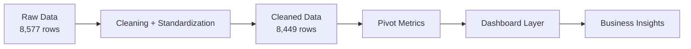

---

## Courier Benchmark (Exact)

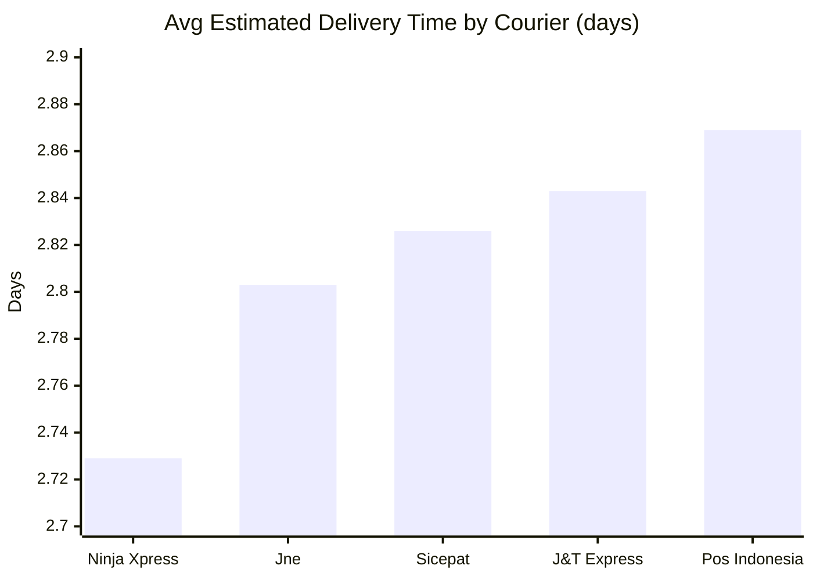

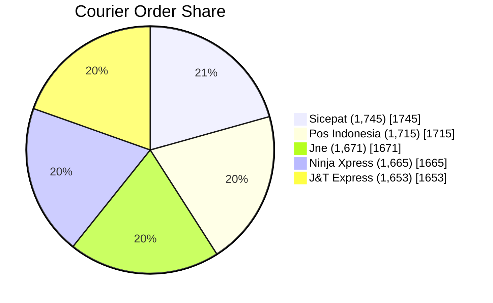

| Courier | Orders | Avg Days | Avg Rating |
|---|---:|---:|---:|
| Ninja Xpress | 1,665 | 2.729 | 2.968 |
| Jne | 1,671 | 2.803 | 2.981 |
| Sicepat | 1,745 | 2.826 | 3.006 |
| J&T Express | 1,653 | 2.843 | 2.995 |
| Pos Indonesia | 1,715 | 2.869 | 3.026 |

---

## Delivery-Type Performance (Exact)

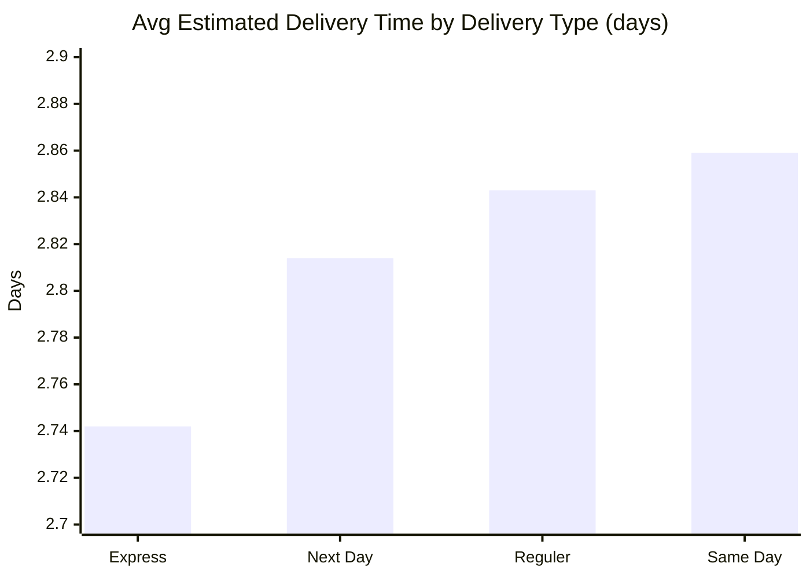

| Delivery Type | Orders | Avg Days |
|---|---:|---:|
| Express | 2,145 | 2.742 |
| Next Day | 2,031 | 2.814 |
| Reguler | 2,125 | 2.843 |
| Same Day | 2,148 | 2.859 |

---

## City-Level Contrast (Only Cities >= 150 Orders)

### Fastest Cities
- Malang: **2.611** days (435 orders)
- Surakarta: **2.657** days (411 orders)
- Makassar: **2.686** days (440 orders)
- Tangerang: **2.702** days (440 orders)
- Yogyakarta: **2.705** days (431 orders)

### Slowest Cities
- Semarang: **2.971** days (409 orders)
- Depok: **2.953** days (443 orders)
- Bandung: **2.931** days (423 orders)
- Bogor: **2.927** days (410 orders)
- Surabaya: **2.916** days (430 orders)

---

## Business Insights

- Delivery performance gap between couriers exists, but it is relatively tight.
- `Ninja Xpress` is fastest by average delivery days.
- `Pos Indonesia` has the highest average product rating.
- Service label and speed are not perfectly aligned in this data (`Same Day` is slowest on average).
- City-level differences indicate local operational bottlenecks/opportunities.

---

## Repository Map

```text
DVA-Capstone/
├── Rawdataset/
│   └── Dataset_ecommerce - Raw_Data.csv
├── Cleaned/
│   └── Dataset_ecommerce - cleaned.csv
├── Calculations_Pivots/
│   └── Dataset_ecommerce - cleaned - Pivot Table.csv
├── dashboard/
│   ├── Dataset_ecommerce - cleaned - Dashboard.csv
│   ├── Dataset_ecommerce - cleaned - Dashboard.pdf
│   └── dashboard.png
├── Documentation/
│   ├── Delivery_Performance_Analysis.pdf
│   └── Report.pdf
└── README.md
```

---

## Data Dictionary

| Field | Description |
|---|---|
| `product_id` | Product/order ID |
| `order_date` | Order date (`DD/MM/YY`) |
| `courier_delivery` | Courier partner |
| `city` | Destination city |
| `district` | Destination district |
| `type_of_delivery` | Service level (`Express`, `Next Day`, `Reguler`, `Same Day`) |
| `estimated_delivery_time_days` | Estimated shipping duration in days |
| `product_rating` | Customer rating (1-5) |

---

## Dashboard Contents

- KPI cards (orders, avg delivery time, avg rating)
- Courier speed comparison
- Delivery-type comparison
- Courier order-share split
- City performance ranking
- Filter-driven exploratory view

---

## Team

**Group 4 | Section A**
# Delivery Performance Intelligence

<div align="center">


</div>

---

## Project Focus

This capstone evaluates e-commerce delivery performance across Indonesia using courier, geography, and delivery-type dimensions.

Primary question:
**Which operational levers improve delivery speed while maintaining customer satisfaction?**

---

## Exact Dataset Snapshot

Numbers below are computed directly from files in this repository (`Rawdataset` + `Cleaned`):

- Raw records: **8,577**
- Cleaned records: **8,449**
- Rows removed/resolved during cleaning: **128**
- Courier partners: **5**
- Cities: **20**
- Districts: **329**
- Average estimated delivery time: **2.814 days**
- Average product rating: **2.996 / 5**
- Date range in cleaned file: **11/06/2022 to 11/06/2023**

---

## Data-to-Insight Pipeline

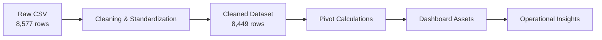

---

## Courier Performance (Exact)

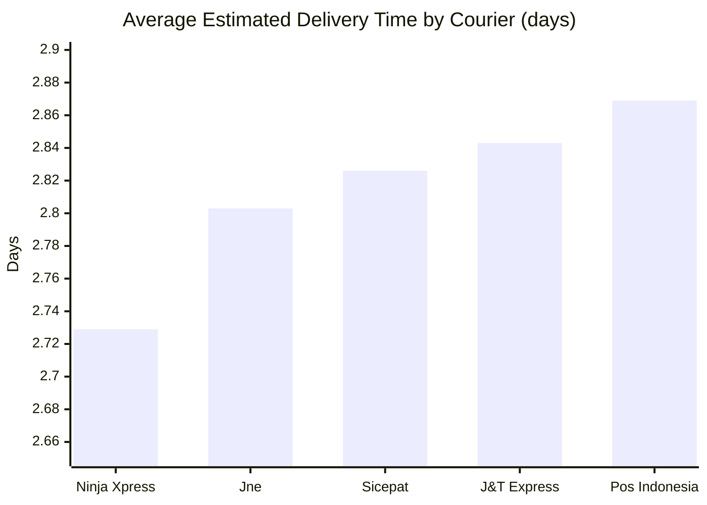

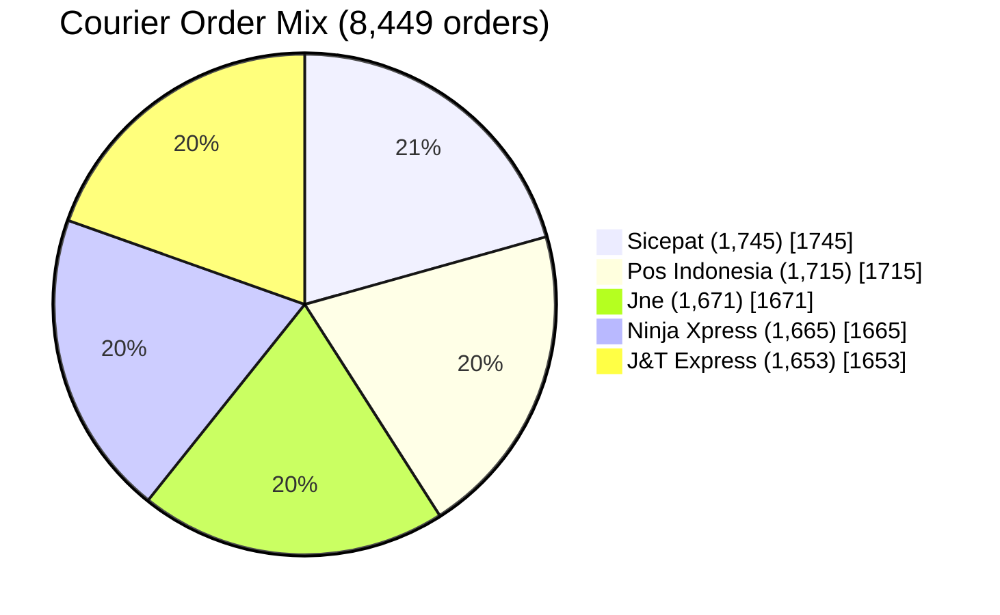

Courier summary table:

| Courier | Orders | Avg Delivery Days | Avg Rating |
|---|---:|---:|---:|
| Ninja Xpress | 1,665 | 2.729 | 2.968 |
| Jne | 1,671 | 2.803 | 2.981 |
| Sicepat | 1,745 | 2.826 | 3.006 |
| J&T Express | 1,653 | 2.843 | 2.995 |
| Pos Indonesia | 1,715 | 2.869 | 3.026 |

---

## Delivery-Type Analysis (Exact)

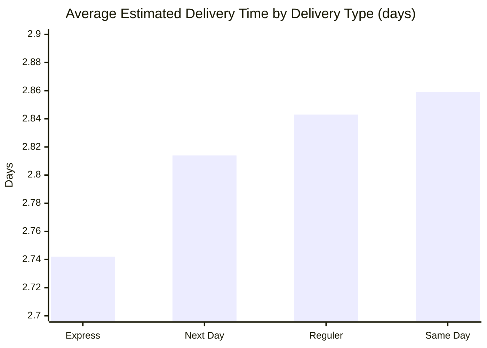

| Delivery Type | Orders | Avg Delivery Days |
|---|---:|---:|
| Express | 2,145 | 2.742 |
| Next Day | 2,031 | 2.814 |
| Reguler | 2,125 | 2.843 |
| Same Day | 2,148 | 2.859 |

---

## Geography Contrast (Cities with 150+ Orders)

Fastest:
- Malang (**2.611**, 435 orders)
- Surakarta (**2.657**, 411 orders)
- Makassar (**2.686**, 440 orders)
- Tangerang (**2.702**, 440 orders)
- Yogyakarta (**2.705**, 431 orders)

Slowest:
- Semarang (**2.971**, 409 orders)
- Depok (**2.953**, 443 orders)
- Bandung (**2.931**, 423 orders)
- Bogor (**2.927**, 410 orders)
- Surabaya (**2.916**, 430 orders)

---

## Key Business Insights

- Delivery-time differences across couriers are measurable but narrow.
- `Ninja Xpress` leads on speed; `Pos Indonesia` leads slightly on average rating.
- Service labels do not perfectly map to speed expectations (`Same Day` appears slowest in this dataset).
- City-level operations likely explain a meaningful share of variability.

---

## Repository Structure

```text
DVA-Capstone/
├── Rawdataset/
│   └── Dataset_ecommerce - Raw_Data.csv
├── Cleaned/
│   └── Dataset_ecommerce - cleaned.csv
├── Calculations_Pivots/
│   └── Dataset_ecommerce - cleaned - Pivot Table.csv
├── dashboard/
│   ├── Dataset_ecommerce - cleaned - Dashboard.csv
│   ├── Dataset_ecommerce - cleaned - Dashboard.pdf
│   └── dashboard.png
├── Documentation/
│   ├── Delivery_Performance_Analysis.pdf
│   └── Report.pdf
└── README.md
```

---

## Data Dictionary

| Field | Description |
|---|---|
| `product_id` | Product/order identifier |
| `order_date` | Order placement date (`DD/MM/YY`) |
| `courier_delivery` | Courier partner name |
| `city` | Delivery city |
| `district` | Delivery district |
| `type_of_delivery` | Service tier (`Express`, `Next Day`, `Reguler`, `Same Day`) |
| `estimated_delivery_time_days` | Estimated shipment duration in days |
| `product_rating` | Customer product rating from 1 to 5 |

---

## Dashboard Components

- KPI cards (total orders, avg delivery time, avg rating)
- Courier speed comparison
- Delivery type vs speed view
- Courier share distribution
- City performance ranking
- Interactive slicer-based filtering

---

## Team

**Group 4 | Section A**
# Delivery Performance Intelligence

<div align="center">

### E-commerce Logistics Analytics Capstone

From raw shipment data to a recruiter-ready operations intelligence story.


</div>

---

## Why This Project Stands Out

This project analyzes courier delivery behavior across Indonesia and transforms a noisy dataset into business-ready operational insight.  
It focuses on speed, reliability, and customer satisfaction to answer a key logistics question:

**Which delivery levers actually improve customer experience at scale?**

---

## Executive Snapshot

- **8,577** raw records profiled
- **8,449** cleaned records retained (**128 rows resolved/removed**)
- **5 couriers**, **20 cities**, **329 districts**
- **Average estimated delivery time:** `2.814 days`
- **Average product rating:** `2.996 / 5`
- **Data period:** `2022-01-07` to `2023-12-05`

---

## Tech Stack

<div align="center">


</div>

---

## Data Pipeline

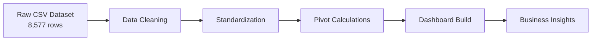

---

## What Was Cleaned

- Removed duplicate/irrelevant records
- Standardized categorical labels (`courier_delivery`, `city`, `district`)
- Normalized `estimated_delivery_time_days` into numeric form
- Reshaped date values for consistent timeline analysis
- Prepared pivot-ready data for dashboard KPIs and charts

---

## Performance Insights

### 1) Courier Speed Benchmark (lower is better)

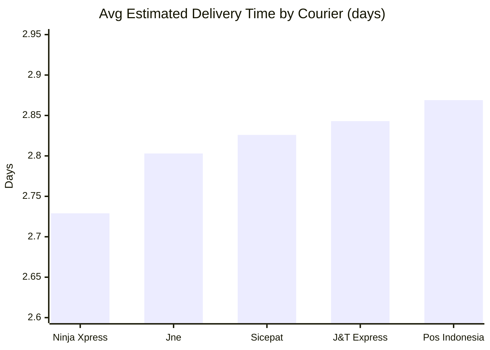

**Takeaway:** `Ninja Xpress` is the fastest performer, while `Pos Indonesia` is the slowest by average delivery duration.

### 2) Delivery Type Behavior

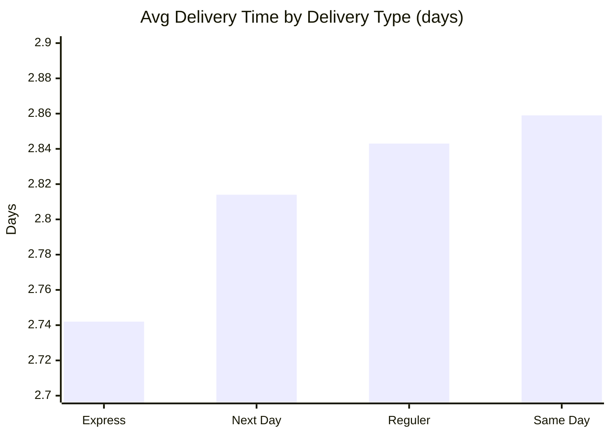

**Takeaway:** `Express` is fastest; `Same Day` appears slowest in this dataset, signaling possible process or labeling nuances.

### 3) Order Share by Courier


**Takeaway:** Workload is evenly distributed; no single courier dominates volume.

### 4) City-Level Delivery Contrast

- **Fastest large cities (150+ orders):**
  - Malang (`2.611`)
  - Surakarta (`2.657`)
  - Makassar (`2.686`)
  - Tangerang (`2.702`)
  - Yogyakarta (`2.705`)

- **Slowest large cities (150+ orders):**
  - Semarang (`2.971`)
  - Depok (`2.953`)
  - Bandung (`2.931`)
  - Bogor (`2.927`)
  - Surabaya (`2.916`)

---

## Business Interpretation

- Courier-level speed differences are measurable but relatively narrow
- Service-tier labels do not always map to expected speed outcomes
- Geographic segmentation matters: city-level operations likely drive significant variance
- Product ratings are stable across couriers, suggesting service speed is not the only CX driver

---

## Repository Structure

```text
DVA-Capstone/
├── Rawdataset/
│   └── Dataset_ecommerce - Raw_Data.csv
├── Cleaned/
│   └── Dataset_ecommerce - cleaned.csv
├── Calculations_Pivots/
│   └── Dataset_ecommerce - cleaned - Pivot Table.csv
├── dashboard/
│   └── Dataset_ecommerce - cleaned - Dashboard.csv
└── readme.md
```

---

## Data Dictionary

| Field | Description |
|---|---|
| `product_id` | Product/order identifier |
| `order_date` | Date order was placed |
| `courier_delivery` | Courier partner |
| `city` | Delivery city |
| `district` | Delivery district |
| `type_of_delivery` | Service level (Express, Next Day, Reguler, Same Day) |
| `estimated_delivery_time_days` | Estimated shipment duration in days |
| `product_rating` | Customer rating (1 to 5) |

---

## Dashboard Features

- KPI cards: total orders, avg delivery time, avg rating
- Courier-level delivery comparison
- Delivery type vs speed comparison
- Courier order-share donut
- City performance ranking
- Slicers for courier, delivery type, and city analysis

---

## Recruiter Quick Pitch

This capstone demonstrates end-to-end analytics execution:
- data cleaning discipline,
- metric design,
- visual storytelling,
- and operational insight extraction from real-world logistics data.

It reflects the practical mindset expected in Data Analyst, Business Analyst, and Operations Analytics roles.

---

## Team

**Group 4 | Section A**
# Delivery Performance Intelligence

<div align="center">

### E-commerce Logistics Analytics Capstone

From raw shipment data to a recruiter-ready operations intelligence story.


</div>

---

## Why This Project Stands Out

This project analyzes courier delivery behavior across Indonesia and transforms a noisy dataset into business-ready operational insight.  
It focuses on speed, reliability, and customer satisfaction to answer a key logistics question:

**Which delivery levers actually improve customer experience at scale?**

---

## Executive Snapshot

- **8,577** raw records profiled
- **8,449** cleaned records retained (**128 rows resolved/removed**)
- **5 couriers**, **20 cities**, **329 districts**
- **Average estimated delivery time:** `2.814 days`
- **Average product rating:** `2.996 / 5`
- **Data period:** `2022-01-07` to `2023-12-05`

---

## Tech Stack

<div align="center">


</div>

---

## Data Pipeline


---

## What Was Cleaned

- Removed duplicate/irrelevant records
- Standardized categorical labels (`courier_delivery`, `city`, `district`)
- Normalized `estimated_delivery_time_days` into numeric form
- Reshaped date values for consistent timeline analysis
- Prepared pivot-ready data for dashboard KPIs and charts

---

## Performance Insights

### 1) Courier Speed Benchmark (lower is better)


**Takeaway:** `Ninja Xpress` is the fastest performer, while `Pos Indonesia` is the slowest by average delivery duration.

### 2) Delivery Type Behavior


**Takeaway:** `Express` is fastest; `Same Day` appears slowest in this dataset, signaling possible process or labeling nuances.

### 3) Order Share by Courier


**Takeaway:** Workload is evenly distributed; no single courier dominates volume.

### 4) City-Level Delivery Contrast

- **Fastest large cities (150+ orders):**
  - Malang (`2.611`)
  - Surakarta (`2.657`)
  - Makassar (`2.686`)
  - Tangerang (`2.702`)
  - Yogyakarta (`2.705`)

- **Slowest large cities (150+ orders):**
  - Semarang (`2.971`)
  - Depok (`2.953`)
  - Bandung (`2.931`)
  - Bogor (`2.927`)
  - Surabaya (`2.916`)

---

## Business Interpretation

- Courier-level speed differences are measurable but relatively narrow
- Service-tier labels do not always map to expected speed outcomes
- Geographic segmentation matters: city-level operations likely drive significant variance
- Product ratings are stable across couriers, suggesting service speed is not the only CX driver

---

## Repository Structure

```text
DVA-Capstone/
├── Rawdataset/
│   └── Dataset_ecommerce - Raw_Data.csv
├── Cleaned/
│   └── Dataset_ecommerce - cleaned.csv
├── Calculations_Pivots/
│   └── Dataset_ecommerce - cleaned - Pivot Table.csv
├── dashboard/
│   └── Dataset_ecommerce - cleaned - Dashboard.csv
└── readme.md
```

---

## Data Dictionary

| Field | Description |
|---|---|
| `product_id` | Product/order identifier |
| `order_date` | Date order was placed |
| `courier_delivery` | Courier partner |
| `city` | Delivery city |
| `district` | Delivery district |
| `type_of_delivery` | Service level (Express, Next Day, Reguler, Same Day) |
| `estimated_delivery_time_days` | Estimated shipment duration in days |
| `product_rating` | Customer rating (1 to 5) |

---

## Dashboard Features

- KPI cards: total orders, avg delivery time, avg rating
- Courier-level delivery comparison
- Delivery type vs speed comparison
- Courier order-share donut
- City performance ranking
- Slicers for courier, delivery type, and city analysis

---

## Recruiter Quick Pitch

This capstone demonstrates end-to-end analytics execution:
- data cleaning discipline,
- metric design,
- visual storytelling,
- and operational insight extraction from real-world logistics data.

It reflects the practical mindset expected in Data Analyst, Business Analyst, and Operations Analytics roles.

---

## Team

**Group 4 | Section A**