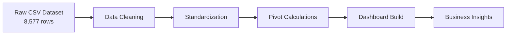
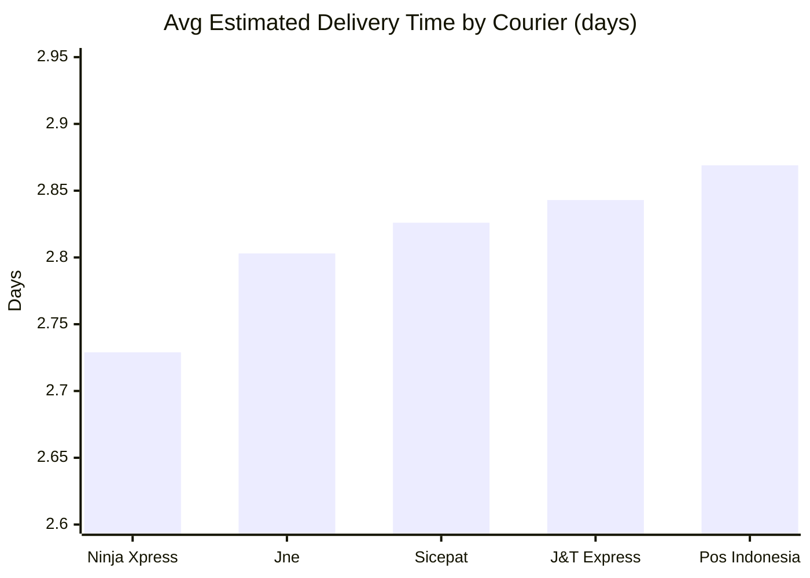
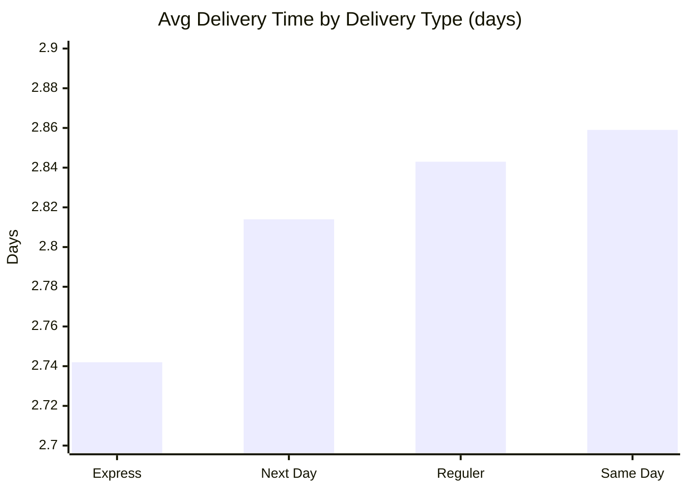
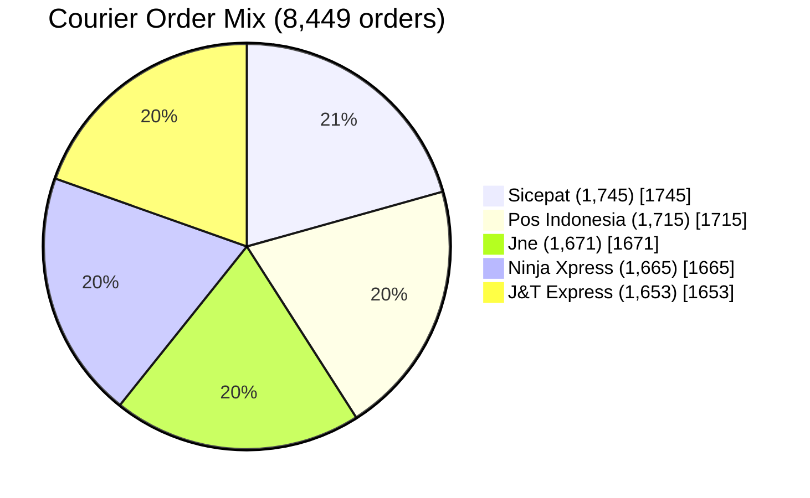

# Delivery Performance Intelligence

<div align="center">

### E-commerce Logistics Analytics Capstone

From raw shipment data to a recruiter-ready operations intelligence story.


</div>

---

## Why This Project Stands Out

This project analyzes courier delivery behavior across Indonesia and transforms a noisy dataset into business-ready operational insight.  
It focuses on speed, reliability, and customer satisfaction to answer a key logistics question:

**Which delivery levers actually improve customer experience at scale?**

---

## Executive Snapshot

- **8,577** raw records profiled
- **8,449** cleaned records retained (**128 rows resolved/removed**)
- **5 couriers**, **20 cities**, **329 districts**
- **Average estimated delivery time:** `2.814 days`
- **Average product rating:** `2.996 / 5`
- **Data period:** `2022-01-07` to `2023-12-05`

---

## Tech Stack

<div align="center">


</div>

---

## Data Pipeline



---

## What Was Cleaned

- Removed duplicate/irrelevant records
- Standardized categorical labels (`courier_delivery`, `city`, `district`)
- Normalized `estimated_delivery_time_days` into numeric form
- Reshaped date values for consistent timeline analysis
- Prepared pivot-ready data for dashboard KPIs and charts

---

## Performance Insights

### 1) Courier Speed Benchmark (lower is better)



**Takeaway:** `Ninja Xpress` is the fastest performer, while `Pos Indonesia` is the slowest by average delivery duration.

### 2) Delivery Type Behavior



**Takeaway:** `Express` is fastest; `Same Day` appears slowest in this dataset, signaling possible process or labeling nuances.

### 3) Order Share by Courier



**Takeaway:** Workload is evenly distributed; no single courier dominates volume.

### 4) City-Level Delivery Contrast

- **Fastest large cities (150+ orders):**
  - Malang (`2.611`)
  - Surakarta (`2.657`)
  - Makassar (`2.686`)
  - Tangerang (`2.702`)
  - Yogyakarta (`2.705`)

- **Slowest large cities (150+ orders):**
  - Semarang (`2.971`)
  - Depok (`2.953`)
  - Bandung (`2.931`)
  - Bogor (`2.927`)
  - Surabaya (`2.916`)

---

## Business Interpretation

- Courier-level speed differences are measurable but relatively narrow
- Service-tier labels do not always map to expected speed outcomes
- Geographic segmentation matters: city-level operations likely drive significant variance
- Product ratings are stable across couriers, suggesting service speed is not the only CX driver

---

## Repository Structure

```text
DVA-Capstone/
├── Rawdataset/
│   └── Dataset_ecommerce - Raw_Data.csv
├── Cleaned/
│   └── Dataset_ecommerce - cleaned.csv
├── Calculations_Pivots/
│   └── Dataset_ecommerce - cleaned - Pivot Table.csv
├── dashboard/
│   └── Dataset_ecommerce - cleaned - Dashboard.csv
└── readme.md
```

---

## Data Dictionary

| Field | Description |
|---|---|
| `product_id` | Product/order identifier |
| `order_date` | Date order was placed |
| `courier_delivery` | Courier partner |
| `city` | Delivery city |
| `district` | Delivery district |
| `type_of_delivery` | Service level (Express, Next Day, Reguler, Same Day) |
| `estimated_delivery_time_days` | Estimated shipment duration in days |
| `product_rating` | Customer rating (1 to 5) |

---

## Dashboard Features

- KPI cards: total orders, avg delivery time, avg rating
- Courier-level delivery comparison
- Delivery type vs speed comparison
- Courier order-share donut
- City performance ranking
- Slicers for courier, delivery type, and city analysis

---

## Recruiter Quick Pitch

This capstone demonstrates end-to-end analytics execution:
- data cleaning discipline,
- metric design,
- visual storytelling,
- and operational insight extraction from real-world logistics data.

It reflects the practical mindset expected in Data Analyst, Business Analyst, and Operations Analytics roles.

---

## Team

**Group 4 | Section A**
# Delivery Performance Intelligence

<div align="center">

### E-commerce Logistics Analytics Capstone

From raw shipment data to a recruiter-ready operations intelligence story.


</div>

---

## Why This Project Stands Out

This project analyzes courier delivery behavior across Indonesia and transforms a noisy dataset into business-ready operational insight.  
It focuses on speed, reliability, and customer satisfaction to answer a key logistics question:

**Which delivery levers actually improve customer experience at scale?**

---

## Executive Snapshot

- **8,577** raw records profiled
- **8,449** cleaned records retained (**128 rows resolved/removed**)
- **5 couriers**, **20 cities**, **329 districts**
- **Average estimated delivery time:** `2.814 days`
- **Average product rating:** `2.996 / 5`
- **Data period:** `2022-01-07` to `2023-12-05`

---

## Tech Stack

<div align="center">


</div>

---

## Data Pipeline


---

## What Was Cleaned

- Removed duplicate/irrelevant records
- Standardized categorical labels (`courier_delivery`, `city`, `district`)
- Normalized `estimated_delivery_time_days` into numeric form
- Reshaped date values for consistent timeline analysis
- Prepared pivot-ready data for dashboard KPIs and charts

---

## Performance Insights

### 1) Courier Speed Benchmark (lower is better)


**Takeaway:** `Ninja Xpress` is the fastest performer, while `Pos Indonesia` is the slowest by average delivery duration.

### 2) Delivery Type Behavior


**Takeaway:** `Express` is fastest; `Same Day` appears slowest in this dataset, signaling possible process or labeling nuances.

### 3) Order Share by Courier


**Takeaway:** Workload is evenly distributed; no single courier dominates volume.

### 4) City-Level Delivery Contrast

- **Fastest large cities (150+ orders):**
  - Malang (`2.611`)
  - Surakarta (`2.657`)
  - Makassar (`2.686`)
  - Tangerang (`2.702`)
  - Yogyakarta (`2.705`)

- **Slowest large cities (150+ orders):**
  - Semarang (`2.971`)
  - Depok (`2.953`)
  - Bandung (`2.931`)
  - Bogor (`2.927`)
  - Surabaya (`2.916`)

---

## Business Interpretation

- Courier-level speed differences are measurable but relatively narrow
- Service-tier labels do not always map to expected speed outcomes
- Geographic segmentation matters: city-level operations likely drive significant variance
- Product ratings are stable across couriers, suggesting service speed is not the only CX driver

---

## Repository Structure

```text
DVA-Capstone/
├── Rawdataset/
│   └── Dataset_ecommerce - Raw_Data.csv
├── Cleaned/
│   └── Dataset_ecommerce - cleaned.csv
├── Calculations_Pivots/
│   └── Dataset_ecommerce - cleaned - Pivot Table.csv
├── dashboard/
│   └── Dataset_ecommerce - cleaned - Dashboard.csv
└── readme.md
```

---

## Data Dictionary

| Field | Description |
|---|---|
| `product_id` | Product/order identifier |
| `order_date` | Date order was placed |
| `courier_delivery` | Courier partner |
| `city` | Delivery city |
| `district` | Delivery district |
| `type_of_delivery` | Service level (Express, Next Day, Reguler, Same Day) |
| `estimated_delivery_time_days` | Estimated shipment duration in days |
| `product_rating` | Customer rating (1 to 5) |

---

## Dashboard Features

- KPI cards: total orders, avg delivery time, avg rating
- Courier-level delivery comparison
- Delivery type vs speed comparison
- Courier order-share donut
- City performance ranking
- Slicers for courier, delivery type, and city analysis

---

## Recruiter Quick Pitch

This capstone demonstrates end-to-end analytics execution:
- data cleaning discipline,
- metric design,
- visual storytelling,
- and operational insight extraction from real-world logistics data.

It reflects the practical mindset expected in Data Analyst, Business Analyst, and Operations Analytics roles.

---

## Team

**Group 4 | Section A**