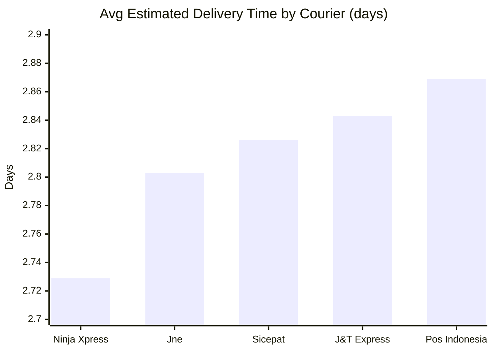
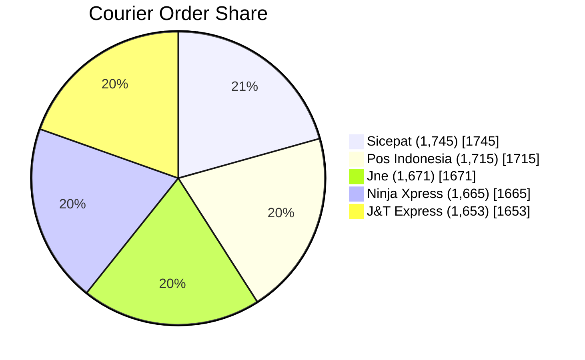
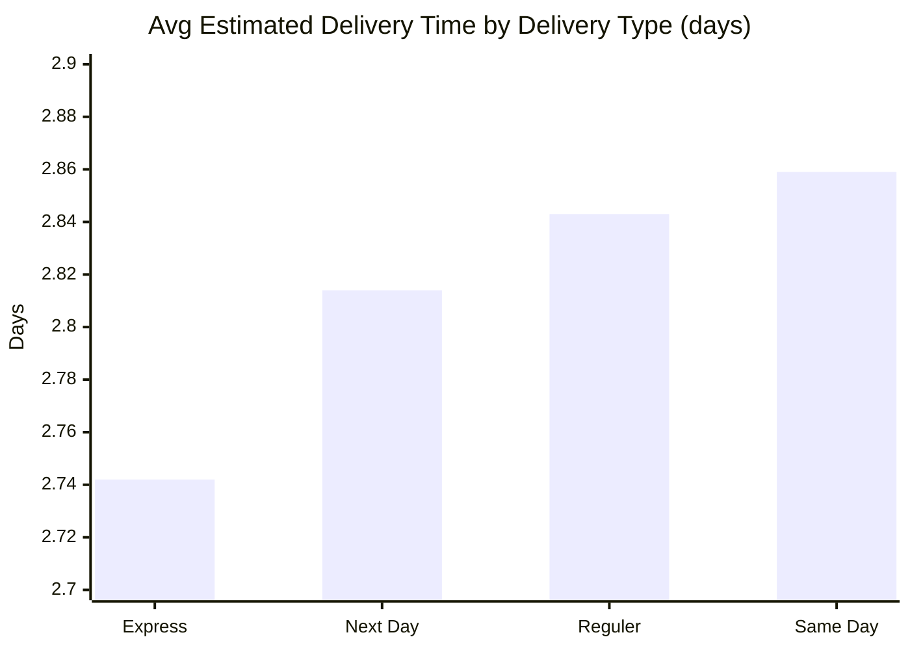

# Delivery Performance Intelligence

<div align="center">


</div>

---

## Mission

This capstone transforms e-commerce shipment records into operational intelligence for courier performance, service-level behavior, and city-level delivery reliability.

Core decision question:
**Which delivery levers improve speed without compromising customer experience?**

---

## Exact Data Snapshot (File-Verified)

All numbers below were computed directly from:
- `Rawdataset/Dataset_ecommerce - Raw_Data.csv`
- `Cleaned/Dataset_ecommerce - cleaned.csv`

| Metric | Value |
|---|---:|
| Raw records | 8,577 |
| Cleaned records | 8,449 |
| Removed/resolved rows | 128 |
| Courier partners | 5 |
| Cities | 20 |
| Districts | 329 |
| Avg estimated delivery time | 2.814 days |
| Avg product rating | 2.996 / 5 |
| Date range | 2022-06-11 to 2023-06-11 |

---

## Pipeline


---

## Courier Benchmark (Exact)





| Courier | Orders | Avg Days | Avg Rating |
|---|---:|---:|---:|
| Ninja Xpress | 1,665 | 2.729 | 2.968 |
| Jne | 1,671 | 2.803 | 2.981 |
| Sicepat | 1,745 | 2.826 | 3.006 |
| J&T Express | 1,653 | 2.843 | 2.995 |
| Pos Indonesia | 1,715 | 2.869 | 3.026 |

---

## Delivery-Type Performance (Exact)



| Delivery Type | Orders | Avg Days |
|---|---:|---:|
| Express | 2,145 | 2.742 |
| Next Day | 2,031 | 2.814 |
| Reguler | 2,125 | 2.843 |
| Same Day | 2,148 | 2.859 |

---

## City-Level Contrast (Only Cities >= 150 Orders)

### Fastest Cities
- Malang: **2.611** days (435 orders)
- Surakarta: **2.657** days (411 orders)
- Makassar: **2.686** days (440 orders)
- Tangerang: **2.702** days (440 orders)
- Yogyakarta: **2.705** days (431 orders)

### Slowest Cities
- Semarang: **2.971** days (409 orders)
- Depok: **2.953** days (443 orders)
- Bandung: **2.931** days (423 orders)
- Bogor: **2.927** days (410 orders)
- Surabaya: **2.916** days (430 orders)

---

## Business Insights

- Delivery performance gap between couriers exists, but it is relatively tight.
- `Ninja Xpress` is fastest by average delivery days.
- `Pos Indonesia` has the highest average product rating.
- Service label and speed are not perfectly aligned in this data (`Same Day` is slowest on average).
- City-level differences indicate local operational bottlenecks/opportunities.

---

## Repository Map

```text
DVA-Capstone/
├── Rawdataset/
│   └── Dataset_ecommerce - Raw_Data.csv
├── Cleaned/
│   └── Dataset_ecommerce - cleaned.csv
├── Calculations_Pivots/
│   └── Dataset_ecommerce - cleaned - Pivot Table.csv
├── dashboard/
│   ├── Dataset_ecommerce - cleaned - Dashboard.csv
│   ├── Dataset_ecommerce - cleaned - Dashboard.pdf
│   └── dashboard.png
├── Documentation/
│   ├── Delivery_Performance_Analysis.pdf
│   └── Report.pdf
└── README.md
```

---

## Data Dictionary

| Field | Description |
|---|---|
| `product_id` | Product/order ID |
| `order_date` | Order date (`DD/MM/YY`) |
| `courier_delivery` | Courier partner |
| `city` | Destination city |
| `district` | Destination district |
| `type_of_delivery` | Service level (`Express`, `Next Day`, `Reguler`, `Same Day`) |
| `estimated_delivery_time_days` | Estimated shipping duration in days |
| `product_rating` | Customer rating (1-5) |

---

## Dashboard Contents

- KPI cards (orders, avg delivery time, avg rating)
- Courier speed comparison
- Delivery-type comparison
- Courier order-share split
- City performance ranking
- Filter-driven exploratory view

---

## Team

**Group 4 | Section A**
